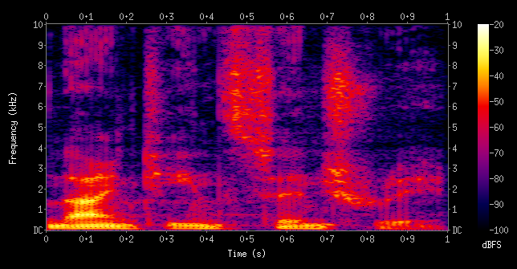

# COUGHvid
COVID-19 cough classification based on audio samples.

# Dataset

The World Health Organization (WHO) has reported that 67.7% of COVID-19 patients exhibit a “dry cough,” which may be audibly different from
coughs caused by other pathologies. Such cough sounds analysis has proven successful in diagnosing respiratory conditions like pertussis,
asthma, and pneumonia. 
I employ the COUGHVID database [1], which is an extensive dataset of COVID-19  cough sounds from around the world, partially validated by expert pulmonologists.

## Feature extraction
I used a Convolutional Neural Network (CNN) for this task of classification. But why using a CNN if we're dealing with audio data ? Infact the first part of pipeline is to obtain a spectrogram of each audio sample. The spectrograms can be seen and treated as images.
To create the spectrogram we use the Short Time Fourier Transform (STFT) that map our audio sample, a time domain signal in the frequency domain.

I obtain this plot with time on x-axis and frequency on y-axis and it show the magnitude of the power spectrum.
Setting correct range of frequencies it's possible to obtain a good and different representation of the audio samples.
And consequently feed these images into a CNN.

Important to choose right ranges and duration of thw windows for the stft, how can I choose that?

## Architecture
I choose to use transfer learning and pre-trained archetecture to reduce training time and just fine tuning the weights

# Future Work
TO-DO

# References
[1] Orlandic, L., Teijeiro, T. & Atienza, D. The COUGHVID crowdsourcing dataset, a corpus for the study of large-scale cough analysis algorithms. *Sci Data* **8,** 156 (2021). https://doi.org/10.1038/s41597-021-00937-4
[2] For downloading the dataset https://c4science.ch/diffusion/10770/
